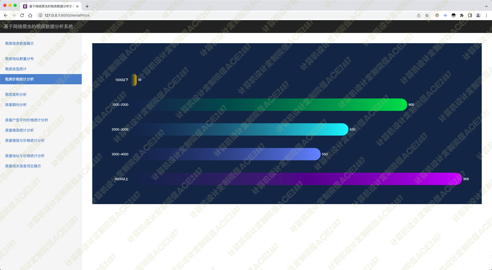
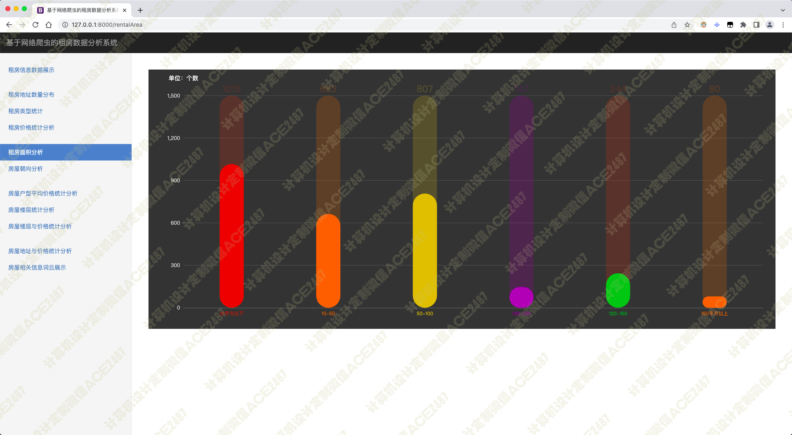
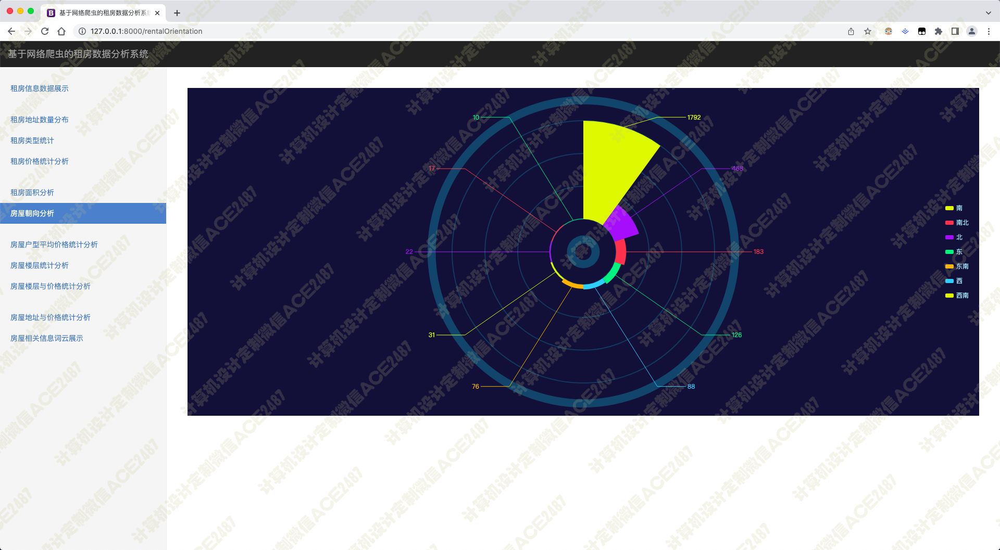
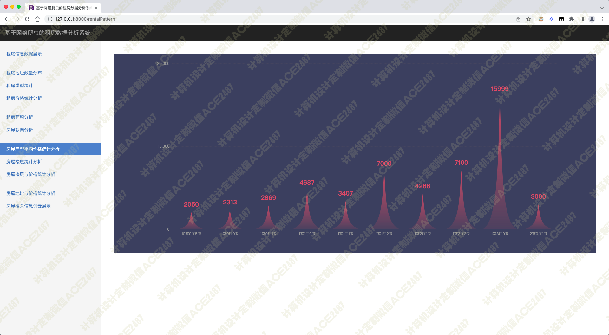
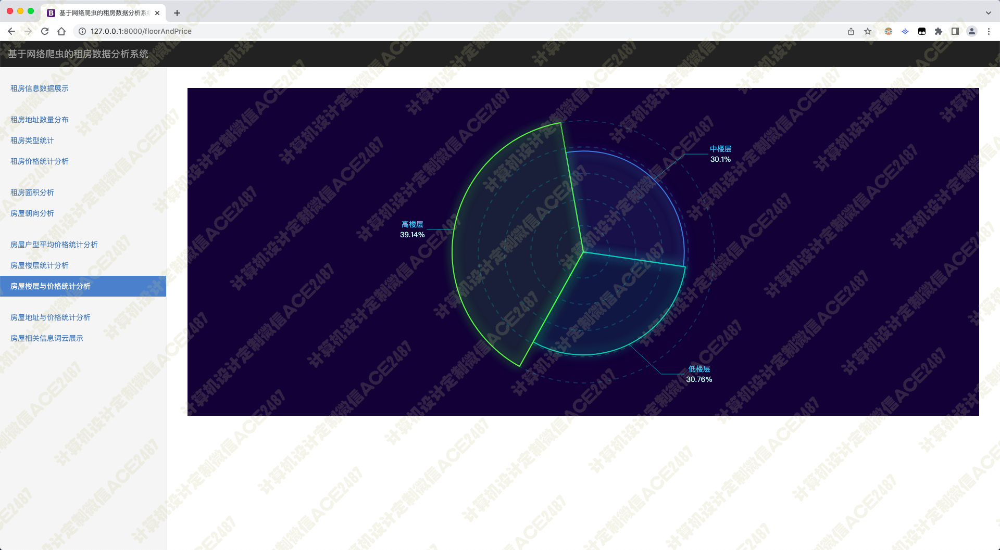
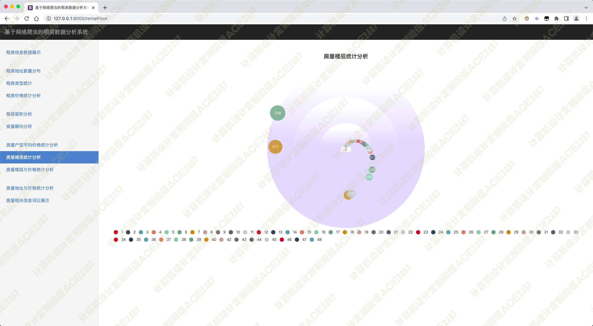
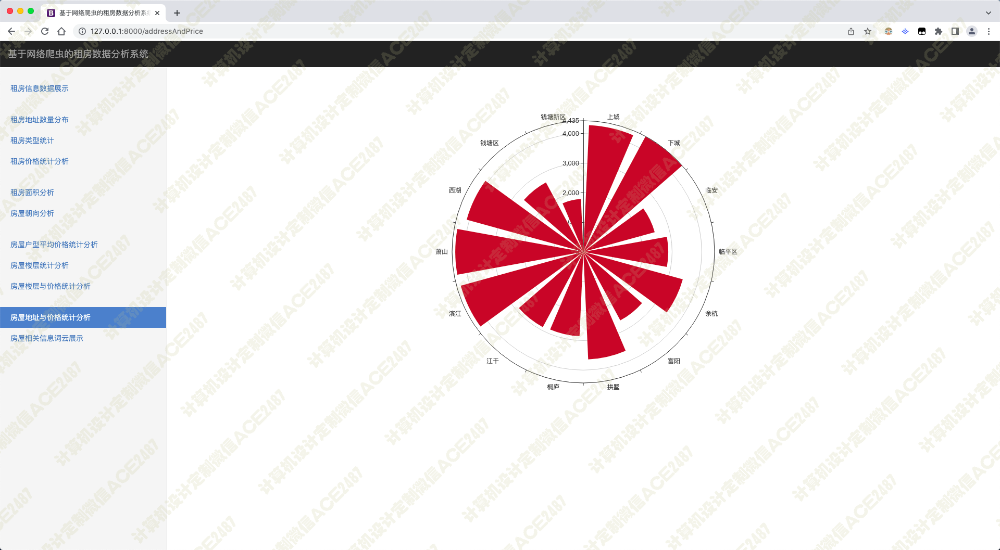
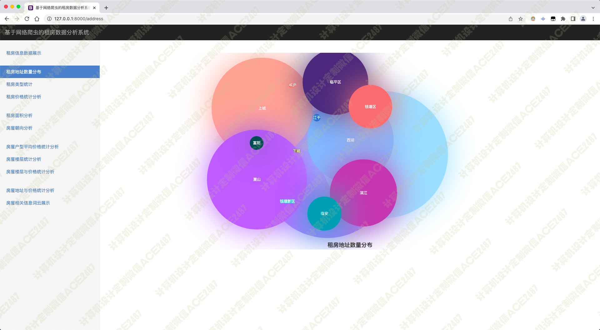
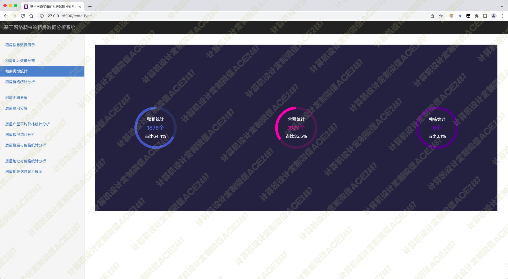

# 013 基于网络爬虫的租房数据分析系统-设计源码展示

> **代码有偿获取 可接受定制 微信联系方式: csbysj2020 或 ACE2487，备注(BS)**

> 

> 

## 技术栈
python scrapy bootstrap jquery css javascript html

租房信息数据展示 租房地址数量分布 租房类型统计 租房价格统计分析 租房面积分析 房屋朝向分析

房屋户型平均价格统计分析 房屋楼层统计分析 房屋楼层与价格统计分析 房屋地址与价格统计分析 房屋相关信息词云展示

## 视频

> **点击查看 \>\>\> [https://www.bilibili.com/video/BV1fY4y137Rz/](https://www.bilibili.com/video/BV1fY4y137Rz/)**

## 截图

